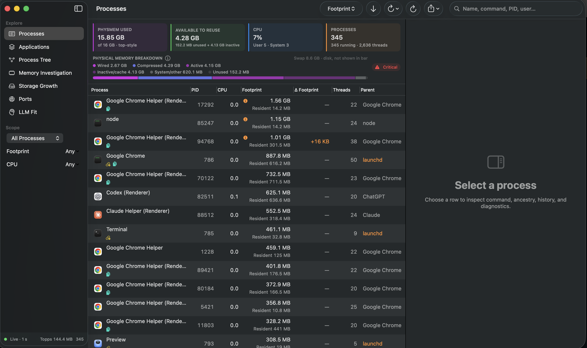
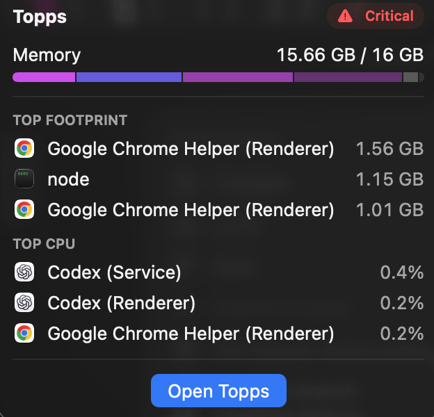

# Topps

**Find out what's using your Mac—and what started it.**

Topps is a native macOS process explorer for developers. Follow a memory-heavy Python process back through its ancestry, find the server holding a port, or see which build folders keep growing. One window, with the details a terminal process list leaves you digging for.



## Get running

You'll need **macOS 14 or newer** and **full Xcode**. The current build is tested with Xcode 26.4; older toolchains aren't verified.

```sh
git clone https://github.com/dafinley/topps.git
cd topps
./run.sh
```

Already in the repository? Just run `./run.sh`. It builds an optimized Release app, quits the previous instance normally, and opens the new one. No developer account or optional tools are needed for a local build.

Prefer Xcode? Open [Topps.xcodeproj](Topps.xcodeproj), choose the **Topps** scheme and **My Mac**, then Run.

These are source-build instructions, not a signed download. See [build help](docs/development.md) or [sharing a team beta](docs/distribution.md).

## Start with a question

- **What's eating memory?** Sort **Processes** by Footprint or Growth. Select a row for its command, history, resident memory, and diagnostics. **Memory Investigation** brings the largest, fastest-growing, and detached processes together.
- **What started all these helpers?** Expand **Applications** for an app's combined usage, or **Process Tree** to follow parent–child relationships.
- **What's using port 3000?** Open **Ports**, search `3000`, and select the owner. See TCP listeners, bound UDP ports, and active connections without leaving the app.
- **Where did my disk space go?** In **Storage Growth**, choose a folder and scan it again later. Compare growth, review caches and `node_modules`, spot build output, or find large files worth moving off your internal drive.
- **Which local models might fit?** **LLM Fit** uses the optional [llmfit](https://github.com/AlexsJones/llmfit) tool to estimate hardware fit. Install it with `brew install llmfit`, then click **Analyze This Mac**. The rest of Topps works without it.

Storage suggestions are leads, not cleanup commands. **Topps never deletes, moves, or uploads your files.**

## A quick look from the menu bar

Memory at a glance, plus the top three processes by footprint and CPU. Open the full window when something needs a closer look.



## A few numbers worth understanding

**Footprint isn't resident RAM.** A process can be charged more memory than is currently resident—even more than the Mac's installed RAM. Process footprints also don't add up to the system total.

**Available to Reuse overlaps PhysMem Used.** Inactive/cache memory can be both occupied and reclaimable. The colored bar breaks down physical memory only; it isn't a chart of the four cards above it.

**A snapshot isn't a live connection log.** Ports refreshes on entry when its snapshot is at least 10 seconds old. **Scan Now** refreshes immediately. Storage scans happen only when requested.

The [user guide](docs/user-guide.md) covers those details, missing ports, and paused sampling.

## Local by default

Topps itself has no telemetry, accounts, or cloud service. Process history stays in memory; storage snapshots stay on your Mac. Optional external tools have their own behavior. Review exported commands and paths before sharing them.

Normal operation doesn't require root. macOS can still hide protected processes or files, so missing information isn't proof that nothing is there. Termination is explicit and limited to your own processes.

## Dig deeper

- [User guide](docs/user-guide.md) — everyday workflows, memory accounting, and troubleshooting.
- [Development](docs/development.md) — builds, tests, architecture, and memory safeguards.
- [Distribution](docs/distribution.md) — a small team beta now, signed downloads later.
- [Memory investigation](docs/memory-validation-2026-09-16.md) — what we found, changed, and measured.
